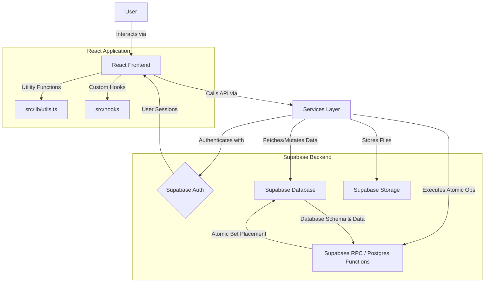

# Architecture Diagram

Here is a high-level overview of the application's architecture using Mermaid.js syntax.

```mermaid
graph TD
    A[User] -->|Interacts via| B[React Frontend]
    B -->|Calls API via| C[Services Layer]
    C -->|Authenticates with| D{Supabase Auth}
    C -->|Fetches/Mutates Data| E[Supabase Database]
    C -->|Stores Files| F[Supabase Storage]
    C -->|Executes Atomic Ops| G[Supabase RPC / Postgres Functions]
    E -- Database Schema & Data --> G
    D -- User Sessions --> B
    G -- Atomic Bet Placement --> E
    B -- Utility Functions --> H[src/lib/utils.ts]
    B -- Custom Hooks --> I[src/hooks]

    subgraph React Application
        B
        H
        I
    end

    subgraph Supabase Backend
        D
        E
        F
        G
    end
```
