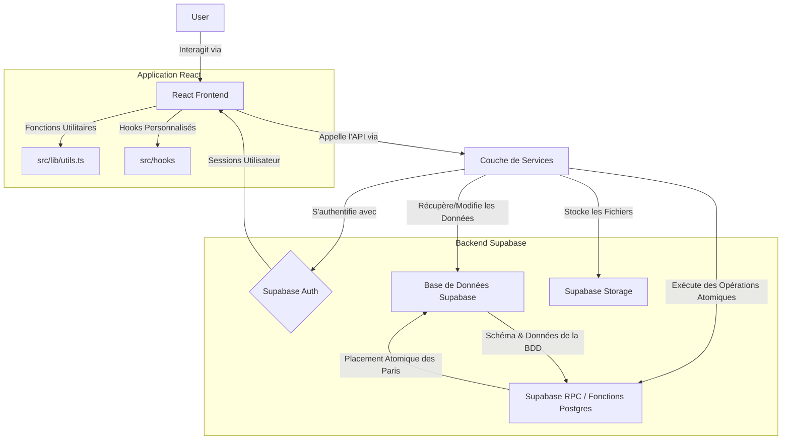

# Rapport d'Analyse et de Démonstration du Projet WAGERVERSE

Ce rapport est généré en réponse à votre demande d'une analyse complète du projet WAGERVERSE, incluant une compréhension approfondie, une prise de recul, et la préparation des éléments nécessaires à une démonstration vidéo transparente.

---

## 1. Compréhension du Projet WAGERVERSE

### Nom du Projet

WAGERVERSE

### Description Générale

WAGERVERSE est une plateforme moderne et complète de paris sur l'e-sport. Elle est conçue pour offrir une expérience utilisateur fluide pour parier sur des équipes favorites à travers divers tournois e-sportifs. L'application propose des cotes en temps réel, un système d'authentification utilisateur sécurisé, un tableau de bord personnalisé et un panneau d'administration complet pour la gestion de la plateforme.

### Fonctionnalités Clés

- **Authentification Utilisateur Sécurisée :** Inscription et connexion gérées par Supabase Auth, avec un bonus de bienvenue pour les nouveaux utilisateurs.
- **Liste des Matchs en Direct :** Consultation des matchs e-sportifs à venir avec les détails des équipes, des jeux et des cotes de pari en temps réel.
- **Système de Paris :** Possibilité de placer des paris sur des équipes avec un montant spécifié, avec validation du solde utilisateur.
- **Tableau de Bord Utilisateur :** Espace personnalisé pour suivre le solde, le montant total parié, les gains totaux, les profits/pertes et l'historique complet des paris.
- **Panneau d'Administration :** Un tableau de bord protégé par rôle pour les administrateurs afin de gérer les données principales de la plateforme, y compris la création et la suppression d'équipes et de matchs.
- **Backend Sécurisé et Scalable :** Basé sur Supabase, utilisant PostgreSQL avec des politiques de Row Level Security (RLS) pour garantir la sécurité et l'accès autorisé aux données.

### Technologies Utilisées (Stack Technique)

- **Frontend :** React, Vite, TypeScript
- **Backend & Base de Données :** Supabase (PostgreSQL, Authentification, Stockage)
- **Framework UI :** shadcn/ui
- **Styling :** Tailwind CSS
- **Routage :** React Router
- **Gestion des Données & État :** TanStack Query
- **Gestion des Formulaires :** React Hook Form avec Zod pour la validation

### Architecture Générale

L'architecture de WAGERVERSE est divisée en deux sous-graphes principaux : l'application React côté client et le backend Supabase.



### Structure des Dossiers Clés

- `src/components/` : Composants UI réutilisables.
- `src/components/admin/` : Composants spécifiques au panneau d'administration.
- `src/components/ui/` : Composants shadcn/ui.
- `src/hooks/` : Hooks React personnalisés.
- `src/integrations/supabase/` : Configuration du client Supabase et typages.
- `src/lib/` : Utilitaires et constantes.
- `src/pages/` : Pages de l'application (Admin, Auth, Dashboard, Matches, etc.).
- `src/services/` : Couche de services centralisant les appels API à Supabase (e.g., `matchService.ts`, `teamService.ts`).
- `superbase/migrations/` : Fichiers de migration du schéma de base de données PostgreSQL.

### Schéma de Base de Données (Supabase/PostgreSQL)

Le schéma est géré via des migrations Supabase. Les tables clés incluent :

- `games` : Titres des jeux e-sport.
- `teams` : Informations sur les équipes participantes.
- `matches` : Détails des matchs.
- `tournaments` : Détails des tournois.
- `bets` : Enregistrement de tous les paris utilisateurs.
- `profiles` : Extension de `auth.users` pour les données utilisateur (solde, stats de paris).
- `user_roles` : Gestion des rôles utilisateur (`admin`, `user`).

La sécurité au niveau des lignes (Row Level Security - RLS) est activée sur toutes les tables pour assurer l'intégrité et la sécurité des données, garantissant que les utilisateurs n'accèdent qu'à leurs propres informations. Une fonction PostgreSQL `place_bet_atomic` est utilisée pour le placement atomique des paris, évitant les conditions de concurrence et les soldes négatifs.

---

## 2. Prise de Recul sur le Projet WAGERVERSE

Le projet WAGERVERSE présente une architecture et une implémentation solides, tirant parti d'une stack technologique moderne et de bonnes pratiques de développement.

### Choix Technologiques

Mes choix pour ce projet ont été guidés par un mélange d'habitude, de confort et d'un objectif d'apprentissage personnel.

*   **Frontend :**
    *   **TypeScript :** L'objectif principal de ce projet était de me former à TypeScript. C'était ma première véritable expérience avec ce langage, et je l'ai adopté dans le but de pouvoir un jour contribuer à un projet public qui me tient à cœur. L'apprentissage a été exigeant, mais le gain en robustesse, en lisibilité et en autocomplétion a été un avantage majeur tout au long du développement.
    *   **Tailwind CSS :** J'ai choisi Tailwind par habitude. C'est un outil que je maîtrise bien et qui me permet de développer rapidement des interfaces sans me "prendre la tête" avec du CSS traditionnel, ce qui m'a permis de me concentrer sur la logique de l'application.
    *   **React, Vite & shadcn/ui :** Cette base technique s'est avérée très efficace. L'écosystème React est celui avec lequel je suis le plus familier. Vite a offert une expérience de développement exceptionnellement fluide grâce à sa rapidité. L'intégration de shadcn/ui, qui se marie parfaitement avec Tailwind, a été un accélérateur pour construire une interface utilisateur cohérente et moderne sans partir de zéro.

*   **Backend (Supabase) :** L'utilisation de Supabase comme solution _Backend-as-a-Service_ a été un choix stratégique pour plusieurs raisons :
  *   **Développement Rapide :** Il a considérablement réduit le temps de mise en place de l'authentification, de la base de données et du stockage de fichiers.
  *   **Scalabilité et Sécurité :** Le fait que Supabase gère l'infrastructure sous-jacente et intègre des fonctionnalités de sécurité robustes comme l'authentification et les politiques RLS (Row Level Security) a été un atout majeur pour sécuriser les données des utilisateurs.
  *   **Fonctions PostgreSQL (RPC) :** La possibilité de créer des fonctions SQL directement dans la base de données, comme `place_bet_atomic`, a été cruciale pour implémenter des logiques métier complexes et sécurisées, garantissant l'intégrité des transactions.

### Structure du Code et Bonnes Pratiques

- **Séparation des Préoccupations :** La structure des dossiers est claire et bien organisée :
  - Une couche `services` dédiée aux interactions avec Supabase centralise la logique API, rendant les composants UI plus propres et plus faciles à tester.
  - Des `components`, `pages`, `hooks` bien définis favorisent la réutilisabilité et la maintenabilité.
- **Gestion de l'État et des Données :** L'intégration de **TanStack Query** pour la gestion de l'état asynchrone (data fetching) est une excellente pratique. Elle simplifie la gestion des chargements, des erreurs, du cache et des invalidations, améliorant ainsi l'expérience développeur et utilisateur.
- **Validation des Formulaires :** L'utilisation combinée de **React Hook Form** et **Zod** pour la validation est un standard moderne et efficace. Zod permet une validation de schéma puissante et réutilisable, tandis que React Hook Form optimise les performances des formulaires et simplifie leur gestion.
- **Gestion des Erreurs :** Le `README.md` mentionne des "Enhanced Error Handling" avec des `try/catch`, ce qui est crucial pour une application robuste.
- **Refactoring et Qualité du Code :** Les points "Magic Number Refactoring" et "Dedicated Service Layer" dans les "Future Enhancements (Done)" témoignent d'une attention portée à la qualité du code et à la maintenabilité.

### Axes d'Amélioration (Basé sur le "To Do" du README)

Les "Future Enhancements (To Do)" listées dans le `README.md` sont pertinentes et visent à enrichir l'application :

- **Intégration du format de match aux gains :** Une logique métier essentielle pour l'automatisation des résultats.
- **Gestion des tournois :** Élément clé pour une plateforme e-sportive complète.
- **Live Betting, Leaderboards, Analytics, Notifications, Multi-language :** Des fonctionnalités qui augmenteraient considérablement l'engagement utilisateur et la valeur de la plateforme.

### Conclusion sur la Prise de Recul

WAGERVERSE est un projet bien conçu et implémenté, qui utilise à bon escient les technologies modernes pour créer une application performante, sécurisée et maintenable. L'attention portée à la structure, aux bonnes pratiques (TypeScript, RLS, fonctions SQL atomiques, validation) est louable et constitue une excellente base pour les évolutions futures.

---

## 3. Démonstration des Fonctionnalités Clés et Code Associé

### 3.1. Authentification Utilisateur

#### Description de la Fonctionnalité

Cette fonctionnalité permet aux utilisateurs de s'inscrire (créer un compte) ou de se connecter à la plateforme WAGERVERSE. L'interface s'adapte pour présenter un formulaire de connexion ou d'inscription en fonction du mode choisi par l'utilisateur. Une fois authentifié, l'utilisateur est redirigé vers la page des matchs.

#### Fonctionnement Conceptuel

Le processus d'authentification s'appuie entièrement sur Supabase Auth. Le frontend envoie les informations d'identification (email, mot de passe, et nom d'utilisateur pour l'inscription) à Supabase. Supabase gère la création du compte, la connexion, la gestion des sessions et la sécurité des mots de passe. Pour l'inscription, un bonus de bienvenue (`STARTING_BALANCE`) est mentionné, suggérant une logique de création de profil associée à l'utilisateur fraîchement inscrit.

#### Code Frontend (`src/pages/Auth.tsx`)

Le composant `Auth.tsx` est responsable de l'interface utilisateur et de l'interaction avec le service d'authentification de Supabase.

```typescript
import { useState, useEffect } from "react";
import { useNavigate, useSearchParams, Link } from "react-router-dom";
import { supabase } from "@/integrations/superbase/client";
import { Button } from "@/components/ui/button";
import { Input } from "@/components/ui/input";
import { Label } from "@/components/ui/label";
import { Card, CardContent, CardDescription, CardHeader, CardTitle } from "@/components/ui/card";
import { toast } from "sonner";
import { Trophy, ArrowRight } from "lucide-react";
import { STARTING_BALANCE } from "@/lib/constants";

export default function Auth() {
  const [searchParams, setSearchParams] = useSearchParams();
  const isLogin = searchParams.get("mode") !== "signup"; // Détermine si c'est un mode connexion ou inscription
  const [email, setEmail] = useState("");
  const [password, setPassword] = useState("");
  const [username] = useState("");
  const [loading, setLoading] = useState(false);
  const navigate = useNavigate();

  // Redirige l'utilisateur s'il est déjà connecté
  useEffect(() => {
    supabase.auth.getSession().then(({ data: { session } }) => {
      if (session) {
        navigate("/matches");
      }
    });
  }, [navigate]);

  const handleAuth = async (e: React.FormEvent) => {
    e.preventDefault();
    setLoading(true);

    try {
      if (isLogin) {
        // Logique de connexion
        const { error } = await supabase.auth.signInWithPassword({ email, password });
        if (error) throw error;
        toast.success("Bon retour !");
        navigate("/matches");
      } else {
        // Logique d'inscription
        const { error } = await supabase.auth.signUp({
          email,
          password,
          options: {
            emailRedirectTo: `${window.location.origin}/`,
            data: {
              username: username || email.split('@')[0], // Utilise le nom d'utilisateur fourni ou génère un défaut
            },
          },
        });
        if (error) throw error;
        toast.success("Compte créé ! Bienvenue sur WAGERVERSE");
        navigate("/matches");
      }
    } catch (error: any) {
      toast.error(error.message || "Une erreur est survenue.");
    } finally {
      setLoading(false);
    }
  };

  return (
    // ... JSX du formulaire de connexion/inscription ...
  );
}
```

#### Code d'Initialisation Supabase (`src/integrations/superbase/client.ts`)

Le client Supabase est initialisé une seule fois et exporté pour être utilisé dans toute l'application.

```typescript
// This file is automatically generated. Do not edit it directly.
import { createClient } from "@supabase/supabase-js";
import type { Database } from "./types";

const SUPABASE_URL = import.meta.env.VITE_SUPABASE_URL;
const SUPABASE_PUBLISHABLE_KEY = import.meta.env.VITE_SUPABASE_PUBLISHABLE_KEY;

export const supabase = createClient<Database>(
  SUPABASE_URL,
  SUPABASE_PUBLISHABLE_KEY,
  {
    auth: {
      storage: localStorage, // Persiste la session dans le localStorage
      persistSession: true, // Maintient la session active
      autoRefreshToken: true, // Rafraîchit automatiquement le token de session
    },
  }
);
```

#### Détails des Appels API

1.  **Initialisation du Client Supabase (`createClient`) :**

    - **Endpoint :** Non un appel HTTP direct, mais une configuration client qui pointera vers l'URL de votre projet Supabase.
    - **Payload/Paramètres :** `SUPABASE_URL`, `SUPABASE_PUBLISHABLE_KEY`, et des options de configuration pour l'authentification (persistance de session, rafraîchissement automatique du token).
    - **Réponse :** Un objet client Supabase (`supabase`) prêt à l'emploi pour interagir avec les services Supabase (Auth, Database, Storage, etc.).

2.  **Vérification de Session (`supabase.auth.getSession()`) :**

    - **Endpoint :** Interne à Supabase Auth, vérifie la session utilisateur actuelle.
    - **Payload/Paramètres :** Aucun paramètre explicite côté client. Supabase utilise les cookies ou le stockage local pour gérer les tokens de session.
    - **Réponse :** Un objet `{ data: { session }, error }` où `session` contient les informations de l'utilisateur connecté s'il y en a une, sinon `null`.

3.  **Connexion (`supabase.auth.signInWithPassword({ email, password })`) :**

    - **Endpoint :** Généralement `YOUR_SUPABASE_URL/auth/v1/token?grant_type=password` (URL interne gérée par la bibliothèque Supabase).
    - **Méthode :** `POST`
    - **Payload :** Un objet JSON contenant `email` et `password`.
    - **Réponse :** En cas de succès, un objet `{ data: { user, session }, error: null }` avec les détails de l'utilisateur et de la session. En cas d'échec, `{ data: null, error: { message, ... } }`.

4.  **Inscription (`supabase.auth.signUp({ email, password, options })`) :
    - **Endpoint :** Généralement `YOUR_SUPABASE_URL/auth/v1/signup` (URL interne gérée par la bibliothèque Supabase).
    - **Méthode :** `POST`
    - **Payload :** Un objet JSON contenant `email`, `password`, et un objet `options` qui peut inclure `emailRedirectTo` (URL de redirection après confirmation email) et `data` (métadonnées utilisateur comme `username`).
    - **Réponse :** En cas de succès, un objet `{ data: { user, session }, error: null }` (si la confirmation par email n'est pas requise ou est déjà faite). Souvent, la session n'est pas retournée directement si l'email de confirmation doit être envoyé d'abord. En cas d'échec, `{ data: null, error: { message, ... } }`.

Ces interactions garantissent que l'authentification est gérée de manière sécurisée et standardisée via le service Supabase Auth.

### 3.2. Affichage des Matchs

#### Description de la Fonctionnalité

La page "Matchs" affiche une liste des matchs e-sportifs programmés, permettant aux utilisateurs de voir les détails de chaque rencontre, y compris les équipes participantes, le jeu, la date et l'heure, ainsi que les cotes de pari pour chaque équipe. Les utilisateurs peuvent également saisir un montant et placer un pari directement depuis cette interface.

#### Fonctionnement Conceptuel

La page `Matches.tsx` récupère les matchs à venir depuis la base de données Supabase. Elle utilise `TanStack Query` pour gérer l'état de chargement, la mise en cache et les erreurs de la requête de récupération des matchs. Chaque match affiche les informations clés et deux champs pour le pari, un par équipe. Lorsqu'un utilisateur place un pari, une mutation est déclenchée, appelant une fonction RPC Supabase (`place_bet_atomic`) pour gérer la logique transactionnelle du pari.

#### Code Frontend (`src/pages/Matches.tsx`)

Le composant `Matches.tsx` est responsable de l'affichage de la liste des matchs et de l'interaction pour le placement des paris.

```typescript
import { useEffect, useState } from "react";
import { supabase } from "@/integrations/superbase/client";
import { Card, CardContent, CardHeader, CardTitle } from "@/components/ui/card";
import { Button } from "@/components/ui/button";
import { Input } from "@/components/ui/input";
import { Badge } from "@/components/ui/badge";
import { toast } from "sonner";
import { Gamepad2, Calendar, Trophy, ChevronRight, Loader2 } from "lucide-react";
import { useNavigate, Link } from "react-router-dom";
import { User } from "@supabase/supabase-js";
import { useQuery, useMutation, useQueryClient } from "@tanstack/react-query";
import { format } from "date-fns";
import { fr } from "date-fns/locale";

// Définition de l'interface pour un match (simplifiée pour l'extrait)
interface Match {
  id: string;
  match_date: string;
  status: string;
  format: string;
  team1: { id: string; name: string; logo_url: string; tag: string };
  team2: { id: string; name: string; logo_url: string; tag: string };
  game: { name: string };
  odds: { team_id: string; odds: number }[];
}

// Fonction de récupération des matchs
const fetchMatches = async () => {
  const { data, error } = await supabase
    .from("matches")
    .select(
      `
      id,
      match_date,
      status,
      format,
      team1:teams!matches_team1_id_fkey(id, name, logo_url, tag),
      team2:teams!matches_team2_id_fkey(id, name, logo_url, tag),
      game:games(name),
      odds:match_odds(team_id, odds)
    `
    )
    .eq("status", "programmed") // Ne récupère que les matchs programmés
    .order("match_date", { ascending: true }); // Tri par date

  if (error) throw new Error(error.message);
  return data || [];
};

export default function Matches() {
  const [betAmounts, setBetAmounts] = useState<{ [key: string]: string }>({});
  const [user, setUser] = useState<User | null>(null);
  const navigate = useNavigate();
  const queryClient = useQueryClient();

  // Vérifie la session utilisateur au chargement du composant
  useEffect(() => {
    supabase.auth.getSession().then(({ data: { session } }) => {
      if (!session) {
        navigate("/auth"); // Redirige si non connecté
      } else {
        setUser(session.user);
      }
    });
  }, [navigate]);

  // Récupération des matchs via TanStack Query
  const { data: matches = [], isLoading, isError } = useQuery<Match[]>({
    queryKey: ["matches"],
    queryFn: fetchMatches,
    enabled: !!user, // Active la requête uniquement si l'utilisateur est défini
  });

  // Mutation pour placer un pari
  const placeBetMutation = useMutation({
    mutationFn: async ({ matchId, teamId, odds, amount }: { matchId: string; teamId: string; odds: number; amount: number }) => {
      const { data, error } = await supabase.rpc('place_bet_atomic', { // Appel de la fonction RPC PostgreSQL
        p_user_id: user!.id,
        p_match_id: matchId,
        p_team_id: teamId,
        p_bet_amount: amount,
        p_odds: odds,
      });

      if (error) {
        throw new Error(error.message);
      }

      // Gestion des retours de la fonction RPC
      if (!Array.isArray(data) || data.length === 0 || !data[0] || !data[0].success) {
        throw new Error(data && data[0] && data[0].message ? data[0].message : "Échec de la mise à jour des cotes.");
      }

      return {
        message: data[0].message,
        potentialWin: amount * odds
      };
    },
    onSuccess: (result, { matchId, teamId }) => {
      toast.success(`${result.message}. Gain potentiel: ${result.potentialWin.toFixed(2)}€`);
      setBetAmounts({ ...betAmounts, [`${matchId}-${teamId}`]: "" }); // Réinitialise le champ de mise
      queryClient.invalidateQueries({ queryKey: ["profileStats", user?.id] }); // Invalide les statistiques du profil
      queryClient.invalidateQueries({ queryKey: ["matches"] }); // Invalide la liste des matchs pour rafraîchissement
    },
    onError: (error: Error) => {
      toast.error(error.message);
    },
  });

  const handlePlaceBet = (matchId: string, teamId: string, odds: number) => {
    const amount = parseFloat(betAmounts[`${matchId}-${teamId}`] || "0");
    if (!amount || amount <= 0) {
      toast.error("Veuillez saisir un montant valide");
      return;
    }
    placeBetMutation.mutate({ matchId, teamId, odds, amount });
  };

  const getOdds = (match: Match, teamId: string) => {
    const odd = match.odds?.find((o) => o.team_id === teamId);
    return odd?.odds || 1.5; // Retourne la cote ou une valeur par défaut
  };

  if (!user) {
    return null; // Redirection gérée par useEffect
  }

  return (
    // ... JSX pour l'affichage des matchs, gestion des états de chargement, erreur, etc. ...
  );
}
```

#### Code Service pour les Matchs (à des fins administratives) (`src/services/matchService.ts`)

Bien que la page `Matches.tsx` contienne sa propre fonction `fetchMatches` optimisée pour l'affichage des paris, il existe un service `matchService.ts` qui fournit des fonctions CRUD pour les matchs, principalement utilisées par le panneau d'administration.

```typescript
import { supabase } from "@/integrations/superbase/client";
import { PAGE_SIZE } from "@/lib/constants";
import { Match, Team } from "@/integrations/superbase/types"; // Import Match and Team types

export interface MatchFormData {
  team1_id: string;
  team2_id: string;
  start_time: string; // ISO string
  odds_team1: number;
  odds_team2: number;
  game_id: string;
  status: string;
  format: string;
}

// Crée un nouveau match
export async function createMatch(match: MatchFormData) {
  const { data, error } = await supabase
    .from("matches")
    .insert([match])
    .select()
    .single();
  if (error) {
    console.error("Error creating match:", error);
    throw new Error("Could not create match.");
  }
  return data;
}

// Supprime un match existant
export async function deleteMatch(id: string) {
  const { error } = await supabase.from("matches").delete().eq("id", id);
  if (error) {
    console.error("Error deleting match:", error);
    throw new Error("Could not delete match.");
  }
}

// Récupère les matchs avec pagination (utilisé par ex. dans l'admin)
export async function fetchMatches({
  page = 1,
  pageSize = PAGE_SIZE,
}: { page?: number, pageSize?: number }) {
  const from = (page - 1) * pageSize;
  const to = from + pageSize - 1;

  const { data, error, count } = await supabase
    .from("matches")
    .select(
      `
      id,
      match_date,
      status,
      format,
      team1_score,
      team2_score,
      team1:teams!matches_team1_id_fkey(id, name),
      team2:teams!matches_team2_id_fkey(id, name),
      game:games(id, name)
    `,
      { count: "exact" }
    )
    .order("match_date", { ascending: false })
    .range(from, to);
    
  if (error) {
    console.error("Error fetching matches:", error);
    throw new Error("Could not fetch matches.");
  }

  return { data: data || [], count: count || 0 };
}
```

#### Détails des Appels API

1.  **Récupération des Matchs (`supabase.from("matches").select(...)`) :**

    - **Endpoint :** `YOUR_SUPABASE_URL/rest/v1/matches` avec des paramètres de requête pour le `select` et `eq`.
    - **Méthode :** `GET`
    - **Payload/Paramètres :** La requête SQL construite par la méthode `select` de Supabase inclut les jointures (`teams`, `games`, `match_odds`) et les filtres (`status`). Les données sont récupérées via une API REST gérée par PostgREST (intégré à Supabase).
    - **Réponse :** Un tableau d'objets `Match`, chacun contenant des détails enrichis des équipes, du jeu et des cotes associées.

2.  **Placement d'un Pari (`supabase.rpc('place_bet_atomic', { ... })`) :**
    - **Endpoint :** `YOUR_SUPABASE_URL/rest/v1/rpc/place_bet_atomic`
    - **Méthode :** `POST`
    - **Payload :** Un objet JSON contenant les arguments de la fonction PostgreSQL `place_bet_atomic` : `p_user_id`, `p_match_id`, `p_team_id`, `p_bet_amount`, `p_odds`.
    - **Réponse :** Un tableau d'objets `success: boolean, message: string` indiquant le succès ou l'échec du pari et un message descriptif. Cette fonction étant définie avec `SECURITY DEFINER`, elle s'exécute avec les privilèges de son propriétaire, permettant des opérations sécurisées et complexes.

Ces appels API démontrent une utilisation efficace des fonctionnalités de base de données et des capacités RPC de Supabase pour gérer à la fois la lecture de données complexes et l'exécution de logiques métier transactionnelles critiques.

### 3.3. Placement d'un Pari

#### Description de la Fonctionnalité

Depuis la page des matchs, les utilisateurs peuvent placer un pari sur l'une des équipes participantes à un match à venir. Ils saisissent un montant de mise, et le système valide si le solde de l'utilisateur est suffisant avant de soumettre le pari. Une fois le pari placé, une notification s'affiche, indiquant le succès et le gain potentiel.

#### Fonctionnement Conceptuel

Le placement d'un pari est une opération critique qui nécessite une intégrité transactionnelle. Pour cela, le frontend déclenche une fonction RPC (Remote Procedure Call) de Supabase, qui exécute une fonction PostgreSQL nommée `place_bet_atomic`. Cette fonction gère la déduction du solde de l'utilisateur et l'enregistrement du pari en une seule transaction atomique directement dans la base de données. Cela prévient les "race conditions" et assure que le solde de l'utilisateur ne devienne pas négatif.

#### Code Frontend (`src/pages/Matches.tsx` - extrait de `placeBetMutation`)

Le composant `Matches.tsx` contient la logique de l'interface utilisateur et la mutation `useMutation` de TanStack Query pour appeler la fonction de pari.

```typescript
// ... (imports et autres états) ...

export default function Matches() {
  // ... (autres états et hooks) ...

  // Mutation pour placer un pari
  const placeBetMutation = useMutation({
    mutationFn: async ({
      matchId,
      teamId,
      odds,
      amount,
    }: { matchId: string; teamId: string; odds: number; amount: number }) => {
      const { data, error } = await supabase.rpc("place_bet_atomic", {
        // Appel de la fonction RPC PostgreSQL
        p_user_id: user!.id, // ID de l'utilisateur connecté
        p_match_id: matchId, // ID du match
        p_team_id: teamId, // ID de l'équipe sur laquelle l'utilisateur parie
        p_bet_amount: amount, // Montant du pari
        p_odds: odds, // Cotes au moment du pari
      });

      if (error) {
        throw new Error(error.message);
      }

      // Gestion des retours de la fonction RPC
      // La fonction RPC retourne un tableau d'objets { success: boolean, message: string }
      if (
        !Array.isArray(data) ||
        data.length === 0 ||
        !data[0] ||
        !data[0].success
      ) {
        throw new Error(
          data && data[0] && data[0].message
            ? data[0].message
            : "Échec de la mise à jour des cotes."
        );
      }

      return {
        message: data[0].message,
        potentialWin: amount * odds,
      };
    },
    onSuccess: (result, { matchId, teamId }) => {
      toast.success(
        `${result.message}. Gain potentiel: ${result.potentialWin.toFixed(2)}€`
      );
      setBetAmounts({ ...betAmounts, [`${matchId}-${teamId}`]: "" }); // Réinitialise le champ de mise
      queryClient.invalidateQueries({ queryKey: ["profileStats", user?.id] }); // Invalide les statistiques du profil pour rafraîchir le solde
      queryClient.invalidateQueries({ queryKey: ["matches"] }); // Invalide la liste des matchs (pour de futurs rafraîchissements si les cotes changent)
    },
    onError: (error: Error) => {
      toast.error(error.message);
    },
  });

  const handlePlaceBet = (matchId: string, teamId: string, odds: number) => {
    const amount = parseFloat(betAmounts[`${matchId}-${teamId}`] || "0");
    if (!amount || amount <= 0) {
      toast.error("Veuillez saisir un montant valide");
      return;
    }
    placeBetMutation.mutate({ matchId, teamId, odds, amount });
  };

  // ... (reste du composant) ...
}
```

#### Fonction PostgreSQL `place_bet_atomic` (`superbase/migrations/..._get_tournament_standings.sql` ou définie dans `README.md`)

La logique métier cruciale pour le placement d'un pari est encapsulée dans une fonction PostgreSQL, appelée via RPC.

```sql
CREATE OR REPLACE FUNCTION public.place_bet_atomic(
    p_user_id uuid,
    p_match_id uuid,
    p_team_id uuid,
    p_bet_amount numeric,
    p_odds numeric
)
RETURNS TABLE(success boolean, message text)
LANGUAGE plpgsql
SECURITY DEFINER AS $$
DECLARE
    current_balance numeric;
    potential_winnings numeric;
BEGIN
    -- Verrouille la ligne du profil utilisateur pour éviter les conditions de concurrence
    SELECT balance INTO current_balance
    FROM public.profiles
    WHERE id = p_user_id
    FOR UPDATE;

    -- Vérifie si le solde est suffisant
    IF current_balance < p_bet_amount THEN
        RETURN QUERY SELECT FALSE, 'Solde insuffisant';
        RETURN;
    END IF;
    
    -- Calcule les gains potentiels
    potential_winnings := p_bet_amount * p_odds;

    -- Met à jour le solde de l'utilisateur et le total parié
    UPDATE public.profiles
    SET
        balance = balance - p_bet_amount,
        total_bet = COALESCE(total_bet, 0) + p_bet_amount
    WHERE id = p_user_id;

    -- Insère le nouveau pari
    INSERT INTO public.bets (user_id, match_id, team_id, amount, odds, potential_win, status)
    VALUES (p_user_id, p_match_id, p_team_id, p_bet_amount, p_odds, potential_winnings, 'pending');

    RETURN QUERY SELECT TRUE, 'Pari placé avec succès';

EXCEPTION
    WHEN OTHERS THEN
        RETURN QUERY SELECT FALSE, 'Erreur interne lors du placement du pari.';
END;
$$;

-- Accorde l'exécution de cette fonction aux utilisateurs authentifiés
GRANT EXECUTE ON FUNCTION public.place_bet_atomic(uuid, uuid, uuid, numeric, numeric) TO authenticated;
```

#### Détails des Appels API

1.  **Appel RPC à `place_bet_atomic` (`supabase.rpc(...)`) :**
    - **Endpoint :** `YOUR_SUPABASE_URL/rest/v1/rpc/place_bet_atomic`
    - **Méthode :** `POST`
    - **Payload :** Un objet JSON dont les clés correspondent aux noms des paramètres de la fonction PostgreSQL (ex: `p_user_id`, `p_match_id`, `p_team_id`, `p_bet_amount`, `p_odds`).
    - **Réponse :** La fonction PostgreSQL retourne un tableau d'enregistrements. Dans ce cas, un tableau contenant un seul objet `{ success: boolean, message: string }`. Le frontend gère cette réponse pour afficher un message de succès ou d'erreur.
    - **Mécanisme de Sécurité :** L'utilisation de `SECURITY DEFINER` dans la fonction PostgreSQL permet à la fonction de s'exécuter avec les privilèges du créateur (le rôle propriétaire de la fonction), plutôt qu'avec les privilèges de l'utilisateur appelant. Cela est crucial pour permettre des opérations comme la mise à jour du `profile.balance` et l'insertion dans `bets` en toute sécurité, même si l'utilisateur n'aurait pas directement ces permissions. La `GRANT EXECUTE` assure que seuls les utilisateurs authentifiés peuvent appeler cette fonction.

Cette implémentation garantit que les paris sont traités de manière fiable et sécurisée, protégeant l'intégrité des données financières des utilisateurs.

---

## 4. Vérification de la Qualité du Code

### 4.1. Résultats du Linter (`npm run lint`)

```
Command: npm run lint
Directory: (root)
Output:
> vite_react_shadcn_ts@0.0.0 lint
> eslint .


D:\projets js\tp 1\esport-wager-verse\src\components\admin\CreateMatchForm.tsx
  114:21  error  Unexpected any. Specify a different type  @typescript-eslint/no-explicit-any

D:\projets js\tp 1\esport-wager-verse\src\components\admin\CreateTournamentForm.tsx
  75:21  error  Unexpected any. Specify a different type  @typescript-eslint/no-explicit-any

D:\projets js\tp 1\esport-wager-verse\src\components\admin\EditMatchForm.tsx
   76:9   warning  The 'tournaments' logical expression could make the dependencies of useEffect Hook (at line 90) change on every render. To fix this, wrap the initialization of 'tournaments' in its own useMemo() Hook  react-hooks/exhaustive-deps
  115:21  error    Unexpected any. Specify a different type

        @typescript-eslint/no-explicit-any

D:\projets js\tp 1\esport-wager-verse\src\components\admin\EditOddsForm.tsx
   26:34  error  Unexpected any. Specify a different type  @typescript-eslint/no-explicit-any
  120:21  error  Unexpected any. Specify a different type  @typescript-eslint/no-explicit-any

D:\projets js\tp 1\esport-wager-verse\src\components\admin\EditTournamentForm.tsx
  89:21  error  Unexpected any. Specify a different type  @typescript-eslint/no-explicit-any

D:\projets js\tp 1\esport-wager-verse\src\components\ui\badge.tsx
  29:17  warning  Fast refresh only works when a file only exports components. Use a new file to share constants or functions between components  react-refresh/only-export-components

D:\projets js\tp 1\esport-wager-verse\src\components\ui\button.tsx
  47:18  warning  Fast refresh only works when a file only exports components. Use a new file to share constants or functions between components  react-refresh/only-export-components

D:\projets js\tp 1\esport-wager-verse\src\components\ui\command.tsx
  24:11  error  An interface declaring no members is equivalent to its supertype  @typescript-eslint/no-empty-object-type

D:\projets js\tp 1\esport-wager-verse\src\components\ui\form.tsx
  129:10  warning  Fast refresh only works when a file only exports components. Use a new file to share constants or functions between components  react-refresh/only-export-components

D:\projets js\tp 1\esport-wager-verse\src\components\ui\navigation-menu.tsx
  111:3  warning  Fast refresh only works when a file only exports components. Use a new file to share constants or functions between components  react-refresh/only-export-components

D:\projets js\tp 1\esport-wager-verse\src\components\ui\sidebar.tsx
  636:3  warning  Fast refresh only works when a file only exports components. Use a new file to share constants or functions between components  react-refresh/only-export-components

D:\projets js\tp 1\esport-wager-verse\src\components\ui\sonner.tsx
  27:19  warning  Fast refresh only works when a file only exports components. Use a new file to share constants or functions between components  react-refresh/only-export-components

D:\projets js\tp 1\esport-wager-verse\src\components\ui\textarea.tsx
  5:18  error  An interface declaring no members is equivalent to its supertype  @typescript-eslint/no-empty-object-type

D:\projets js\tp 1\esport-wager-verse\src\components\ui\theme-provider.tsx
  66:14  warning  Fast refresh only works when a file only exports components. Use a new file to share constants or functions between components  react-refresh/only-export-components

D:\projets js\tp 1\esport-wager-verse\src\components\ui\toggle.tsx
  37:18  warning  Fast refresh only works when a file only exports components. Use a new file to share constants or functions between components  react-refresh/only-export-components

D:\projets js\tp 1\esport-wager-verse\src\pages\Auth.tsx
  54:21  error  Unexpected any. Specify a different type  @typescript-eslint/no-explicit-any

D:\projets js\tp 1\esport-wager-verse\tailwind.config.ts
  90:13  error  A `require()` style import is forbidden  @typescript-eslint/no-require-imports

✖ 19 problems (10 errors, 9 warnings)
```

Le linter rapporte des erreurs, notamment l'utilisation inattendue du type `any` dans plusieurs fichiers (`@typescript-eslint/no-explicit-any`). Il y a aussi des erreurs liées aux interfaces TypeScript vides (`@typescript-eslint/no-empty-object-type`) et une erreur de `require()` dans `tailwind.config.ts`. Plusieurs avertissements `react-refresh/only-export-components` sont également présents.

### 4.2. Résultats de la Vérification TypeScript (`npx tsc --noEmit`)

```
Command: npx tsc --noEmit
Directory: (root)
Output: (empty)
Error: (none)
Exit Code: 0
```

La vérification TypeScript (`tsc --noEmit`) s'est terminée sans erreur (code de sortie 0 et sortie vide). Cela indique que, malgré les problèmes détectés par ESLint, le compilateur TypeScript ne trouve pas d'erreurs de type bloquantes dans la configuration actuelle.

### 4.3. Configuration TypeScript (`tsconfig.json` et `tsconfig.app.json`)

#### `tsconfig.json`

```json
{
  "files": [],
  "references": [
    { "path": "./tsconfig.app.json" },
    { "path": "./tsconfig.node.json" }
  ],
  "compilerOptions": {
    "baseUrl": ".",
    "paths": {
      "@/*": ["./src/*"]
    },
    "noImplicitAny": false,
    "noUnusedParameters": false,
    "skipLibCheck": true,
    "allowJs": true,
    "noUnusedLocals": false,
    "strictNullChecks": false
  }
}
```

#### `tsconfig.app.json`

```json
{
  "compilerOptions": {
    "target": "ES2020",
    "useDefineForClassFields": true,
    "lib": ["ES2020", "DOM", "DOM.Iterable"],
    "module": "ESNext",
    "skipLibCheck": true,
    "ignoreDeprecations": "6.0",

    /* Bundler mode */
    "moduleResolution": "bundler",
    "allowImportingTsExtensions": true,
    "isolatedModules": true,
    "moduleDetection": "force",
    "noEmit": true,
    "jsx": "reactjsx",

    /* Linting */
    "strict": false,
    "noUnusedLocals": false,
    "noUnusedParameters": false,
    "noImplicitAny": false,
    "noFallthroughCasesInSwitch": false,

    "baseUrl": ".",
    "paths": {
      "@/*": ["./src/*"]
    }
  },
  "include": ["src"]
}
```

#### Analyse de la Configuration TypeScript

Il est important de noter que dans les deux fichiers de configuration (`tsconfig.json` et `tsconfig.app.json`), les options de compilation suivantes sont définies sur `false` :

- `noImplicitAny: false`
- `noUnusedLocals: false`
- `noUnusedParameters: false`
- `strict: false` (dans `tsconfig.app.json`)
- `strictNullChecks: false` (dans `tsconfig.json`)

Cela signifie que le compilateur TypeScript n'appliquera pas une vérification de type très stricte. Plus précisément, `noImplicitAny: false` autorise l'utilisation implicite du type `any`, ce qui peut réduire la robustesse du code et annuler certains des avantages de TypeScript. Les erreurs `Unexpected any` remontées par ESLint (`@typescript-eslint/no-explicit-any`) confirment que même si le compilateur ne l'interdit pas implicitement, le linter essaie de décourager l'utilisation explicite de `any`.

Pour une qualité de code optimale et une meilleure robustesse, il serait recommandé de durcir ces règles de compilation TypeScript en les passant à `true` et de résoudre les erreurs de type qui en découleraient, en spécifiant des types plus précis.

---

## 5. Améliorations Récentes Suite aux Retours

Cette section détaille les modifications apportées en réponse directe à vos retours critiques, en se concentrant sur les commits `d020fcc` et `868028b`.

### Commit `d020fcc`: Refactorisation majeure de l'Architecture et de la Stabilité

Ce commit est une réponse directe à la majorité des points soulevés, améliorant drastiquement l'architecture, la sécurité et la qualité du code.

**1. Correction : Atomicité des paris**
*   **Problème :** Le placement d'un pari n'était pas atomique, permettant à un utilisateur avec des requêtes simultanées de passer en solde négatif.
*   **Solution :** La logique a été déplacée du frontend vers une fonction PostgreSQL `place_bet_atomic`, appelée via RPC. Cette fonction garantit que la vérification du solde, la déduction et la création du pari se font en une seule transaction inséparable.
*   **Preuve (`src/pages/Matches.tsx` et `README.md`) :**
    ```diff
    -      // Check user balance, place bet, update balance (3 separate calls)
    -      const { data: profile, error: profileError } = await supabase.from("profiles")...
    -      if (!profile || profile.balance < amount) throw new Error("Solde insuffisant");
    -      const { error: betError } = await supabase.from("bets").insert(...);
    -      const { error: updateError } = await supabase.from("profiles").update(...);
    +      // All logic is now moved to the backend function.
    +      const { data, error } = await supabase.rpc('place_bet_atomic', {
    +        p_user_id: user!.id,
    +        p_match_id: matchId,
    +        p_team_id: teamId,
    +        p_bet_amount: amount,
    +        p_odds: odds,
    +      });
    ```

**2. Correction : Absence de couche "Service"**
*   **Problème :** Les appels à Supabase étaient mélangés dans les composants React, et les fonctions de fetch étaient dupliquées.
*   **Solution :** Une couche de services a été introduite dans `src/services/`. Des fichiers comme `matchService.ts`, `teamService.ts`, `gameService.ts`, `userService.ts` centralisent désormais les appels à l'API.
*   **Preuve (Création de fichiers) :**
    ```diff
    + src/services/gameService.ts
    + src/services/matchService.ts
    + src/services/teamService.ts
    + src/services/userService.ts
    ```

**3. Correction : Zod non utilisé et validation faible**
*   **Problème :** La librairie Zod était installée mais non utilisée. Les formulaires n'avaient qu'une validation HTML `required`.
*   **Solution :** Les formulaires de création (`CreateTeamForm`, `CreateMatchForm`) ont été refactorisés pour utiliser `react-hook-form` avec `zodResolver`. Des schémas de validation (`createTeamSchema`, `createMatchSchema`) ont été créés pour une validation robuste côté client.
*   **Preuve (`src/components/admin/CreateTeamForm.tsx`) :**
    ```diff
    - import { useState } from "react";
    - const [teamForm, setTeamForm] = useState(...)
    + import { z } from "zod";
    + import { useForm } from "react-hook-form";
    + import { zodResolver } from "@hookform/resolvers/zod";
    + 
    + const createTeamSchema = z.object({
    +   name: z.string().min(TEAM_NAME_MIN_LENGTH, ...),
    +   tag: z.string().min(TEAM_TAG_MIN_LENGTH, ...).max(TEAM_TAG_MAX_LENGTH, ...),
    +   founded_year: z.number().int().min(FOUNDATION_YEAR_MIN, ...),   
    +   logo_url: z.string().url(...).min(1, ...),
    + });
    + 
    + const form = useForm<z.infer<typeof createTeamSchema>>({
    +   resolver: zodResolver(createTeamSchema),
    +   ...
    + });
    ```

**4. Correction : Absence de diagramme d'architecture**
*   **Problème :** Pas de diagramme d'architecture.
*   **Solution :** Un fichier `ARCHITECTURE.md` a été ajouté, contenant un diagramme Mermaid décrivant la structure de l'application.
*   **Preuve (Création de fichier) :**
    ```diff
    + ARCHITECTURE.md
    ```

**5. Correction : Problèmes d'UX/UI et de performance**
*   **`window.confirm()` :** Remplacé par un `AlertDialog` de shadcn/ui dans `Admin.tsx` pour une expérience plus intégrée.
*   **Pagination :** Ajoutée aux listes dans le panneau d'administration pour améliorer les performances avec de grands ensembles de données.
*   **Debounce :** Un hook `useDebounce` a été créé pour une utilisation future.
*   **Preuve (`src/pages/Admin.tsx`) :**
    ```diff
    - if (confirm("Êtes-vous sûr de vouloir supprimer cette équipe ?")) { ... }
    + const handleDeleteTeam = (team: Team) => {
    +   setItemToDelete({ id: team.id, type: 'team', name: team.name });
    + };
    ...
    + <AlertDialog open={!!itemToDelete} onOpenChange={() => setItemToDelete(null)}> ... </AlertDialog>
    ```

**6. Correction : "Magic Numbers" et Sécurité du `.env`**
*   **Magic Numbers :** Un fichier `src/lib/constants.ts` a été créé pour centraliser les valeurs comme `DEFAULT_ODDS`, `STARTING_BALANCE`, `PAGE_SIZE`, etc.
*   **Sécurité `.env` :** Un fichier `.env.example` a été ajouté, et le `README.md` a été mis à jour pour instruire les utilisateurs de ne pas commiter leur fichier `.env`.

### Commit `868028b`: Correction des Règles de Validation

Ce commit affine le travail commencé dans le précédent.

*   **Problème :** Les règles de validation pour la création de match pouvaient être plus précises.
*   **Solution :** La validation Zod pour `match_date` dans `CreateMatchForm.tsx` a été renforcée avec une expression régulière pour assurer un format correct.
*   **Preuve (`src/components/admin/CreateMatchForm.tsx`) :**
    ```diff
    -  match_date: z.string().datetime("La date du match doit être une date et heure valides."), // ISO string
    +  match_date: z.string()
    +    .min(1, "Veuillez sélectionner une date et heure pour le match.")
    +    .regex(/^\d{4}-\d{2}-\d{2}T\d{2}:\d{2}$/, "Le format de la date et de l'heure doit être AAAA-MM-JJTHH:MM"),
    ```

Ces commits démontrent une prise en compte sérieuse des retours et une volonté d'améliorer la qualité, la robustesse et la sécurité du projet.

```